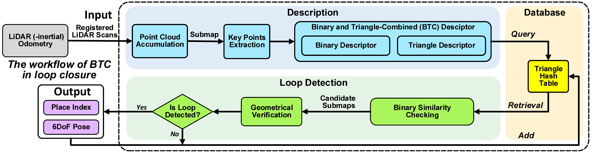
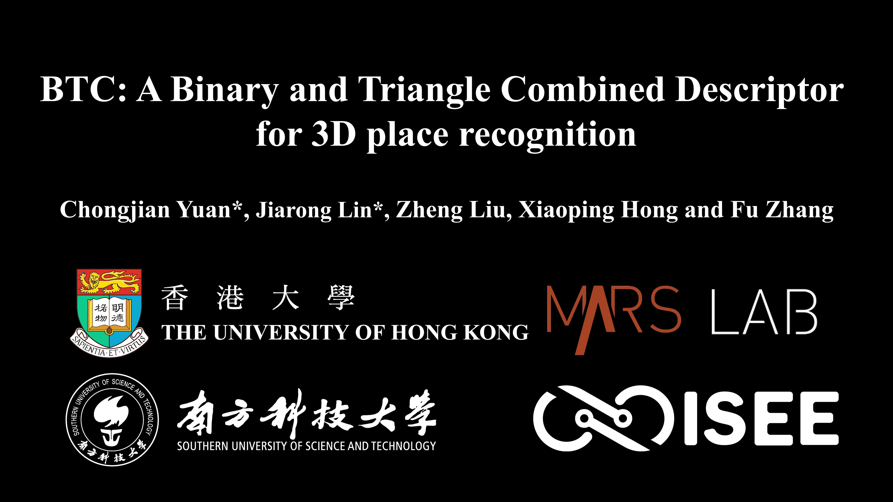

# BTC
## BTC: A Binary and Triangle Combined Descriptor for 3D Place Recognition
## Introduction
**BTC** is a novel global and local combined descriptor for 3D place recognition. To achieve viewpoint invariance, we devise a global triangle descriptor composed of three side lengths of a triangle formed by three keypionts extracted from the accumulated point cloud. The triangle descriptor inherently exhibits viewpoint invariance, as the side lengths remain unchanged regardless of viewpoint or direction. While the triangle descriptor captures the global appearance of the point cloud, to further enhance its descriptive and discriminative capabilities, we develop a local descriptor called binary descriptor that encodes the local geometric information of each keypoint forming the triangle. This combination of global and local descriptors allows for accurate and robust place recognition, even in large-scale unstructured environments.

    

        
    

    System overview of the Binary Triangle Combined (BTC) descriptor for place recognition in a SLAM system.

  

### Developers:
[Chongjian Yuan 袁崇健](https://github.com/ChongjianYUAN)， [Jiarong Lin 林家荣](https://github.com/ziv-lin)

### Related paper
Related paper will be available on **arxiv** soon.  

### Related video
Our accompanying video is now available on **YouTube**.

    

## Codes & Datasets
Our paper is currently under review, and our code will be released once the paper is accepted.